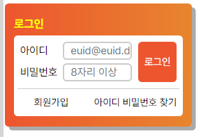

# Mission-02

- Mission-02
  - General info
  - Results
  - Description
    <br/>
    <br/>
    <br/>

### General info

---

Web Cafe 시안에 맞춰 로그인 폼을 구현.
<br/>
<br/>
<br/>

### Results

---

<br/>

<br/>
<br/>
<br/>

### Description

---

  <br/>

#### HTML

- form 요소 내에 h1 태그와 fieldset을 두고, fieldset 내에 두 개의 ul 태그를 넣어 각각 로그인 폼과 링크 요소들을 두었습니다.
  <br/>

```HTML
    <section>
      <form action="/" method="post" class="loginForm border">
        <h1 class="loginHeader">로그인</h1>
        <fieldset class="border">
          <legend class="hidden">로그인</legend>
          <ul class="inputForm border">
            <li>
              <label for="userId">아이디</label>
              <input type="text" name="userId" id="userId" placeholder="euid@euid.de" autofocus required />
            </li>
            <li>
              <label for="userPw">비밀번호</label>
              <input type="password" name="userPw" id="userPw" placeholder="8자리 이상" required />
            </li>
            <button type="submit" class="loginButton border">로그인</button>
          </ul>
          <hr />
          <ul class="linkForm border">
            <li><a href="/">회원가입</a></li>
            <li><a href="/">아이디 비밀번호 찾기</a></li>
          </ul>
        </fieldset>
      </form>
    </section>
```

  <br/>

#### CSS

  <br/>

- 로그인 폼을 감싼 ul에 position: relative;를 주고 button 태그에 position: absolute; 를 주어 위치를 조정했습니다.
  <br/>

```CSS
.inputForm {
  position: relative;
  width: 220px;
  height: 69px;
  padding: 8px;
}
```

```CSS

.loginButton {
  width: 50px;
  height: 53px;
  position: absolute;
  right: 8px;
  top: 8px;
  background-color: var(--primary-color);
  border-radius: 5px;
  color: #ffffff;
}
```

  <br/>

- 회원가입, 아이디/비번찾기 li에는 각각 float의 left와 right를 적용해 위치를 조정했습니다.
  <br/>

```CSS
.linkForm li:first-child {
float: left;
padding-right: 14px;
}
.linkForm li:last-child {
float: right;
}
```
