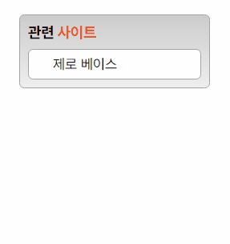

# MISSION-03

- Mission-03
  - General info
  - Requirements
  - Result
  - Description


## General info

web cafe 시안 중 관련 사이트 부분을 구현했습니다.

<br>


## Requirements

- 관련 사이트는 제목으로, 각 항목은 링크로 구현한다.
- 링크 목록은 5개이며 화면에 1개의 목록만 보이도록 구현한다.
- 목록에 마우스를 올리면 5개의 목록이 펼쳐지도록 구현한다.
- transtion 속성을 활용해 애니메이션 효과를 적용한다.

<br>

## Result


<br>



<br>

## Description


<br>

#### HTML

- 마우스를 올리고 떼었을 때 리스트의 전체 높이가 줄어드는 움직임과 text의 위치가 이동하는 움직임의 시간차를 표현하기 위해 div태그로 ul 태그를 감쌌습니다.

<br>

```
section.relatedSite
     ├─ h2.relatedSite__title
     │
     │
     └─ div.relatedSite__wrapper
        └─ ul.relatedSite__ul
          ├─ li.relatedSite__list
          │   └─ a
          │
          ├─ li
          │   └─ a
          │
          ├─ li
          │   └─ a
          │
          ├─ li
          │   └─ a
          │
          └─ li
             └─ a
```

<br>
<br>

#### CSS

- div에 height, ul:hover 에 padding을 주고
  ul에 transition-delay 주어 움직임에 시간차를 주었습니다.

  <br>

```CSS
.relatedSite__wrapper {
  background: white;
  height: 30px;
  overflow: hidden;
  transition: all 400ms;
}

.relatedSite__ul {
  relatedSite__ul: all 400ms ease-in-out 400ms;
}

/* hover 이벤트 */
.relatedSite__wrapper:hover {
  height: 166px;
}
.relatedSite__wrapper:hover .relatedSite__ul {
  padding: 8px 0px;
}
```
