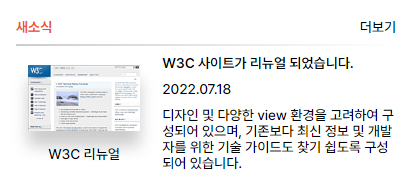

# MISSION-04

- Mission-04
  - General info
  - Requirements
  - Result
  - Description

<br>

## General info

web cafe 시안 중 관련 사이트 부분을 구현했습니다.

<br>

## Requirements

- 더보기 링크 앞에 플러스 기호는 생략해도 무방하다.
- 이미지는 “W3C 리뉴얼”이라는 캡션 위에 썸네일 이미지를 사용한다.
  (해당 이미지는 배경으로 지정하지 말고 &lt;img&gt; 요소를 사용하여 콘텐츠 이미지로 배치)
- grid를 활용하여 레이아웃을 구현한다.
- transtion 속성을 활용해 애니메이션 효과를 적용한다.

<br>

## Result

<br>



<br>

## Description

<br>

#### HTML

- section 내에 div 태그를 2개 사용하여 상단의 title 영역과 하단의 content 영역을 구분했습니다.
- figure 태그를 사용해 img와 figcaption를 담았습니다.
- text의 역할에 맞게 h3, time, p 태그를 사용했습니다.

<br>

```
section.news
├── div.news__title-box
│   ├── h2.news__title
│   └── span.news__more
└── div.news__content
    ├── figure.news__images
    │   ├── img
    │   └── figcaption
    ├── h3.news__heading
    ├── time.news__date
    └── p.news__description

```

<br>

#### CSS

- gird로 colume을 8개 생성했고 row에 auto를 주어 item에 맞춰 자동으로 늘어나게 했습니다.
- grid-template-area를 사용해 요소들에 각각의 영역을 분배했습니다.

  <br>

```CSS
.news__content {
  display: grid;
  grid-template-columns: repeat(8, 1fr);
  grid-template-rows: auto;
  grid-template-areas:
    "img img img heading heading heading heading heading"
    "img img img date date date date date"
    "img img img desc desc desc desc desc"
    "img img img desc desc desc desc desc";
  gap: 10px;
}

.news__images {
  grid-area: img;
  display: flex;
  flex-flow: column nowrap;
  align-items: center;
  padding-top: 10px;
}
.news__heading {
  grid-area: heading;
  font-weight: 600;
}
.news__date {
  grid-area: date;
}
.news__description {
  grid-area: desc;
}
.news__images img {
  box-shadow: 0px 15px 15px #ccc;
  margin-bottom: 15px;
}
```
