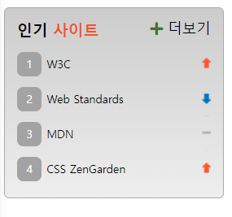

# MISSION-05

- Mission-05
  - General info
  - Requirements
  - Result
  - Description

<br>

## General info

web cafe 시안 중 인기사이트 부분을 구현했습니다.

<br>

## Requirements

- 더보기 링크 앞에 플러스 기호는 생략해도 무방하다.
- rank.png(webcafe-RWD/assets 폴더에 있음) 이미지를 활용하여 스프라이트 기법으로 스타일링 한다.
- 각 인기 사이트의 순위를 나타내는 영역은 기존 &lt;ol&gt; 요소에서 제공하는 기본 숫자를 보이지 않도록 한 후 CSS로 구현한다.

<br>

## Result

<br>



<br>

## Description

<br>

#### HTML

- section 내에 h2와 ol, div를 사용하여 각각 제목, 랭크, 더보기 링크 영역을 나누었습니다.
- ol 태그를 사용하여 목록을 작성했습니다.

<br>

```
section
├── h2
│   └── span
├── ol
│   ├── li
│   │   └── a
│   ├── li
│   │   └── a
│   ├── li
│   │   └── a
│   └── li
│       └── a
└── div
    ├── span
    └── a
```

<br>

#### CSS

- li에 가상태그에 counter-increment를 사용해서 번호를 넣었습니다.
- li.sprite에 background로 스프라이트 이미지를 담고, background-position 사용해 이미지의 위치를 조정하였습니다.

<br>

```CSS
.favSite__list {
  font-size: 11px;
  counter-increment: rank;
}
.favSite__list::before {
  content: counter(rank);
  background: #a3a3a3;
  width: 16px;
  height: 16px;
  display: inline-block;
  margin-right: 5px;
  padding: 4px;
  text-align: center;
  border-radius: 6px;
  color: #fff;
}
```

```CSS
.sprite {
  background: url(./../images/rank.png) no-repeat 100% 0;
}

.sprite:first-child {
  background-position-y: 12px;
}

.sprite:nth-child(2) {
  background-position-y: -32px;
}

.sprite:nth-child(3) {
  background-position-y: -10px;
}

.sprite:last-child {
  background-position-y: 12px;
}

```
